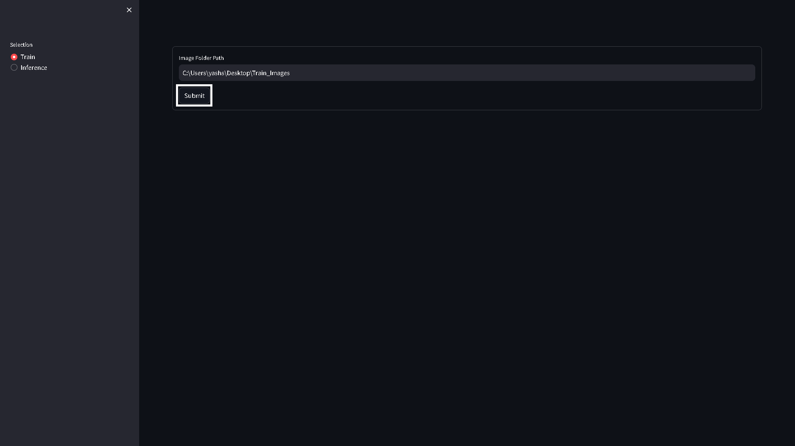

# AnnoyEmbedImageSim
A repository employing advanced deep learning models and Spotify's Annoy for efficient image similarity. Utilizes neural networks to create image embeddings, enabling fast and accurate comparisons within extensive image datasets.

## How To Install

To set up the environment, use the provided `environment.yaml` file. Execute the following command in your terminal to create the environment:

```bash
conda env create -f environment.yml
```

## How To Run

Execute the following command to start the application:

```bash
streamlit run frontend.py
```

## How it Works

**Image Folder Path:** Path to the training image folder.

**Test Image Path:** Path to the test image.

**Number of Similar Images:** Indicates the quantity of visually similar images. This will display a defined number of similar images from the training folder as the output.



## References

- [Spotify Annoy](https://github.com/spotify/annoy)
- [Train dataset](https://www.kaggle.com/datasets/zarkonium/synthetic-image-dataset-cats-dogs-bikes-cars?select=cars)